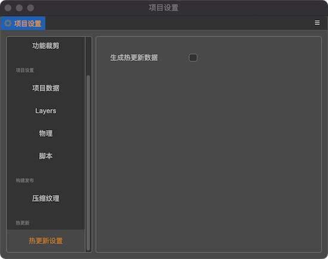
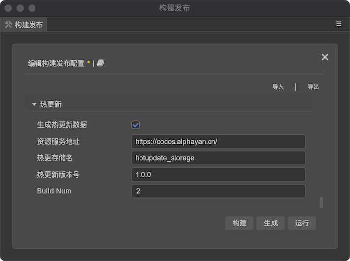

# 热更新插件
## 功能介绍
- 支持命令行构建。
- 构建后在项目目录下自动生成热更新文件, 目录结构如下：
```
.
├── hotupdate-assets                // 热更新文件根目录
│   └── mac                         // 对应构建平台, 上传 CDN 需从此目录开始上传
│       ├── 1.0.0.1                 // 版本号 + buildNum
│       │   ├── assets
│       │   ├── jsb-adapter
│       │   ├── project.manifest
│       │   └── src
│       ├── 1.0.0.2
│       │   ├── assets
│       │   ├── jsb-adapter
│       │   ├── project.manifest
│       │   └── src
│       ├── project.manifest       // 每次都会被替换为最新一次构建结果
│       └── version.manifest       // 每次都会被替换为最新一次构建结果
├── package.json
└── tsconfig.json
```
- main.js 脚本注入热更相关代码，具体逻辑为参考官方热更文档
```js
`// inject by extensions ${PACKAGE_NAME} ---- start ----
jsb.fileUtils.addSearchPath(jsb.fileUtils.getWritablePath() + "${packageOptions.storagePath}", true);
var fileList = [];
var storagePath = "${packageOptions.storagePath}";
var tempPath = storagePath + "_temp/";
var baseOffset = tempPath.length;

if (jsb.fileUtils.isDirectoryExist(tempPath) && !jsb.fileUtils.isFileExist(tempPath + 'project.manifest.temp')) {
    jsb.fileUtils.listFilesRecursively(tempPath, fileList);
    fileList.forEach(srcPath => {
        var relativePath = srcPath.substr(baseOffset);
        var dstPath = storagePath + relativePath;
        if (srcPath[srcPath.length - 1] === "/") {
            jsb.fileUtils.createDirectory(dstPath)
        } else {
            if (jsb.fileUtils.isFileExist(dstPath)) {
                jsb.fileUtils.removeFile(dstPath)
            }
            jsb.fileUtils.renameFile(srcPath, dstPath);
        }
    })
    jsb.fileUtils.removeDirectory(tempPath);
}
// inject by extensions ${PACKAGE_NAME} ---- end ----`
```
- 项目设置中配置是否开启热更功能 (默认关闭)

## 使用教程
- 构建 packages 配置, 建议选在 [项目->构建发布->对应平台设置好之后提交]


    ```js
    // 命令行构建, packages 对应配置, 对应选项没有则使用默认配置
    {
        "hot-update": {
            // 热更服务地址, CDN 地址...
            "remoteAddress": "http: //192.168.123.108",
            // 热更文件存储目录, 会自动加入到 searchPath, 
            "storagePath": "hotupdate_storage",
            // 版本号
            "version": "1.0.0",
            // jenkins buildNum | 或其他构建工具
            "buildNum": 1
        }
    }
    ```
- 使用方式
    [Demo](https://)

- 命令行构建:
    ```shell
    .../CocosCreator --project ProjectPath --build "platform=mac;packages={\"hot-update\":{\"version\":\"1.0.0\",\"buildNum\":1}}"

    ```
- 注意事项:
    - 创建 AssetsManager 不传比较函数的话, 热更新版本号不要填写超过 3 位数字, 因为插件会把 buildNum 拼到最后一位, C++ 中的默认比较函数只取 版本号的前 4 个数字进行比较. 
